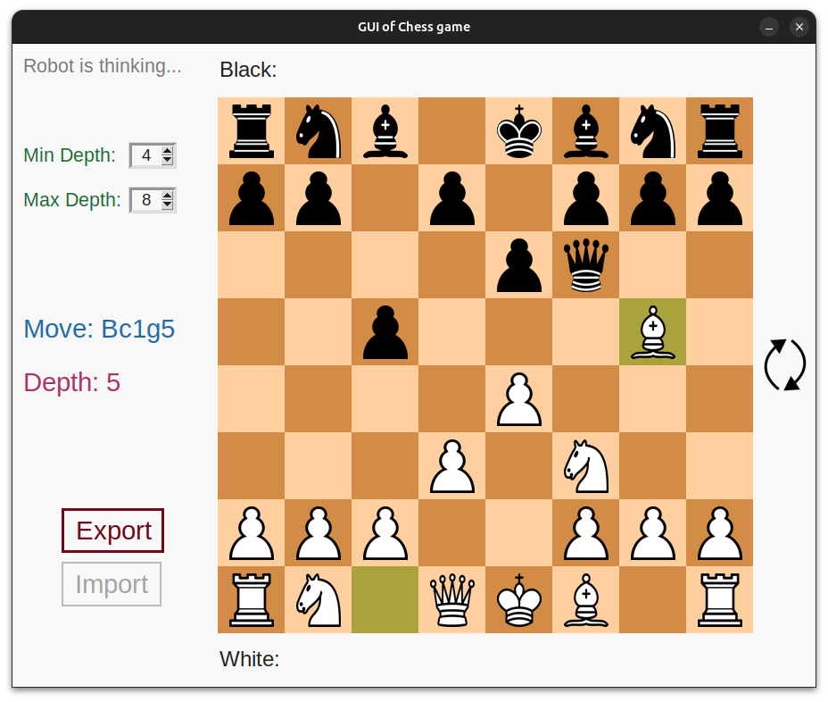

# Tobi Chess-bot

As our project for the science festival, we decided to make a chess engine almost from scratch.

This project consists of a chess robot along with an user interface.

## What it looks like

## How to use
Either download the entire repository and run the GUI using a Python interpreter (preferably Python 3) [`chess_game_GUI`](./src/chess_game_GUI.py). Make sure all used Python packages are downloaded (ex: Tkinter, PIL,...). **Or** directly choose the executable that best suits your computer (Linux/Windows/MacOS) from the [releases](https://github.com/GNInk-code/Tobi-Chess-bot/releases/latest). We may not be considered "official editors" by your operating system, so it might consider these executables as possible threats.
Please be aware of the following disclaimer.

### Disclaimer

**Caution: Use at Your Own Risk**

By downloading, installing, or executing this software (the "chess_game_GUI (Linux/Windows/MacOS)" executable and/or the source Python files), you acknowledge that the Software is provided "AS IS" and that the author (and contributors) disclaim any liability for damages resulting from its use.

**No Warranty**: The Software is not guaranteed to work as intended on all systems, and the author makes no warranty of merchantability or fitness for a particular purpose. Use of the Software may void warranties on your hardware or operating system.

**Your Responsibility**: You assume full responsibility for any damage, data loss, or other consequences that may result from downloading, installing, or executing the Software on your computer.

**By using this software, you acknowledge that you have read and understood these disclaimers.**

You can customize it to fit your project's specific needs. This text is not a substitute for proper documentation, licensing, or liability protection.

## The robot

- We used some specific opening moves for the first 3 moves.
- We used the minimax algorithm along with alpha-beta pruning
- The evaluation function is quite basic and consists of counting the difference of material and adding bonuses to pieces if they go on specific squares.

## License

This project is released under the GNU General Public License (GPL) version 3.
See [LICENSE](./LICENSE) for details.

Copyright (C) 2026 GNInk-code and Alexis2010CM.
